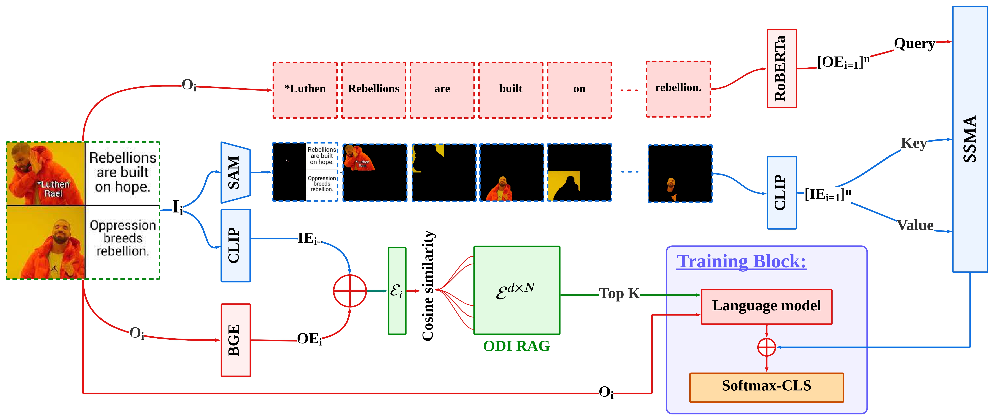

# DarkNet

This repo contains code for **DarkNet**, a submission for **CIKM 2025**, along with the dataset.

The architecture below provides a visual breakdown of the core components of the model:


---

## Step 0: Setup

Create and activate a virtual environment using Python 3.8.10:

```bash
cd DarkNet
python3.8 -m venv venv
source venv/bin/activate  # or .\venv\Scripts\activate on Windows
```

Then install the required dependencies:

```bash
pip install -r requirements.txt
```

---

## Step 1: Download and Unzip Dataset

Download the zip file from here: **[[link](https://drive.google.com/file/d/1ScysZw71sPuMKbl41U0XyRaI9tn_nbV3/view?usp=sharing)]**  
Place it in the main folder, then unzip:

or 

just run this command:

```bash
gdown "https://drive.google.com/uc?id=1ScysZw71sPuMKbl41U0XyRaI9tn_nbV3"
```
Now
```bash
unzip final_data.zip
```

---

## Step 2: Segment Dataset Using SAM

To segment the whole dataset using SAM, run:

```bash
python segment_data.py
```

**Note:** For SAM installation and setup, please follow the instructions at:  
[https://github.com/facebookresearch/segment-anything](https://github.com/facebookresearch/segment-anything)

---

## Step 3: RAG Creation with CLIP & BGE

For ODI RAG creation, we use CLIP and BGE to encode image segments and OCR text, respectively.  
The RAG data has been preprocessed and is located in the `rag/` directory.

---

## Step 4: Model Training

Set hyperparameters and batch size accordingly in `model.py`, which contains the implementation of the DarkNet model.

To train the model, run:

```bash
python train.py
```

**Note:** This code is for **intensity classification**.  
To adapt it for **target classification**, adjust the hyperparameters in both the dataloader and `model.py`, then re-run `train.py`.

---

## Citation

**BigText coming soon**
